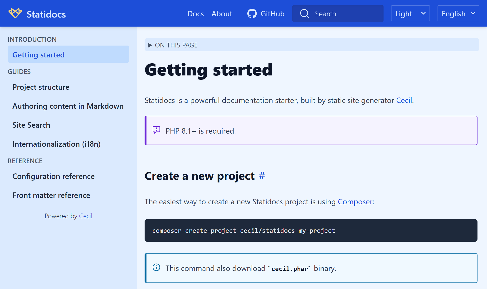

# _Docs_ theme

Documentation theme for [Cecil](https://cecil.app), powered by [Tailwind CSS](https://tailwindcss.com) and [Algolia DocSearch](https://docsearch.algolia.com).



## Features

- Auto-generated navigation sidebar (based on nested sections)
- [Algolia DocSearch](https://docsearch.algolia.com) integration
- Ready for content localization (l10n)
- Templates internationalization (i18n)
- Mobile friendly
- Dark theme
- Blog posts templates

## Installation

```bash
composer require cecil/theme-docs
```

> Or [download the latest archive](https://github.com/Cecilapp/theme-docs/releases/latest/) and uncompress its content in `themes/docs`.

## Usage

Add `docs` in the `theme` section of the `config.yml`:

```yaml
theme:
  - docs
```

### Configuration

The navigation sidebar is generated automatically from the folders structure of
`pages/docs/`, based on [nested sections](https://cecil.app/documentation/content/#sub-section):
each sub-folder containing an `index.md` file becomes a (collapsible) group, at
any depth. Ordering is based on pages `weight` (e.g. a `1-` filename prefix or a
`weight` front matter variable).

```yaml
footer: Copyright © %author%
github:
  repo: https://github.com/<org>/<repo>
  branch: <main|master>
docsearch:
  enabled: true|false
  appId: <YOUR_APP_ID>
  indexName: <YOUR_INDEX_NAME>
  apiKey: <YOUR_SEARCH_API_KEY>
  debug: false|true
```

## Development

### Install deps

```bash
composer install
```

### Rebuild CSS

```bash
composer css:build
```

CSS is compiled with [tailwind-builder](https://github.com/ArnaudLigny/tailwind-builder),
which uses the [Tailwind](https://tailwindcss.com) standalone binary (no Node.js required).

## License

_Docs_ theme is a free software distributed under the terms of the MIT license.

© [Arnaud Ligny](https://arnaudligny.fr)
