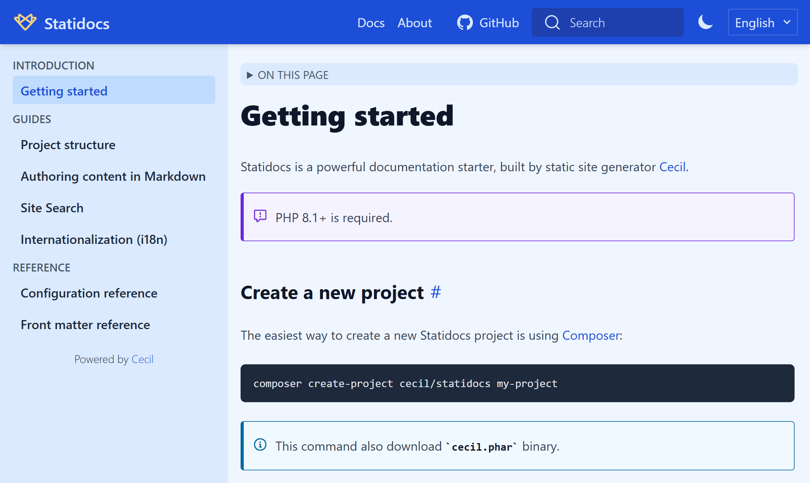

# _Docs_ theme

Documentation theme for [Cecil](https://cecil.app), powered by [Tailwind CSS](https://tailwindcss.com) and [Algolia DocSearch](https://docsearch.algolia.com).



## Features

- Auto-generated navigation sidebar
- [Algolia DocSearch](https://docsearch.algolia.com) integration
- Ready for content localization (l10n)
- Templates internationalization (i18n)
- Mobile friendly
- Dark theme
- Blog posts templates

## Installation

```bash
composer require cecil/theme-docs
```

> Or [download the latest archive](https://github.com/Cecilapp/theme-docs/releases/latest/) and uncompress its content in `themes/docs`.

## Usage

Add `docs` in the `theme` section of the `config.yml`:

```yaml
theme:
  - docs
```

### Configuration

```yaml
sidebar:
  - <group>
  - <group>
footer: Copyright © %author%
github:
  repo: https://github.com/<org>/<repo>
  branch: <main|master>
docsearch:
  enabled: true|false
  appId: <YOUR_APP_ID>
  indexName: <YOUR_INDEX_NAME>
  apiKey: <YOUR_SEARCH_API_KEY>
  debug: false|true
```

## Development

### Install deps

```bash
npm install
```

### Rebuild CSS

```bash
npx @tailwindcss/cli -i ./tailwind.css -o ./assets/styles.css
```

## License

_Docs_ theme is a free software distributed under the terms of the MIT license.

© [Arnaud Ligny](https://arnaudligny.fr)
